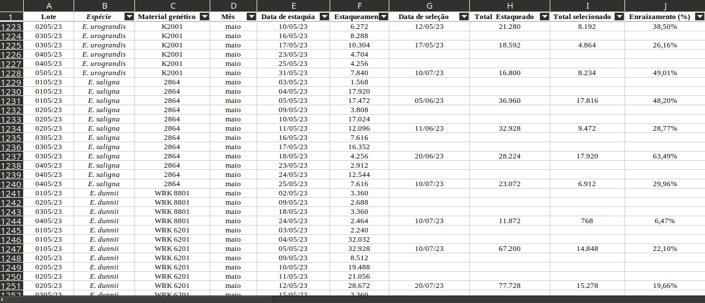
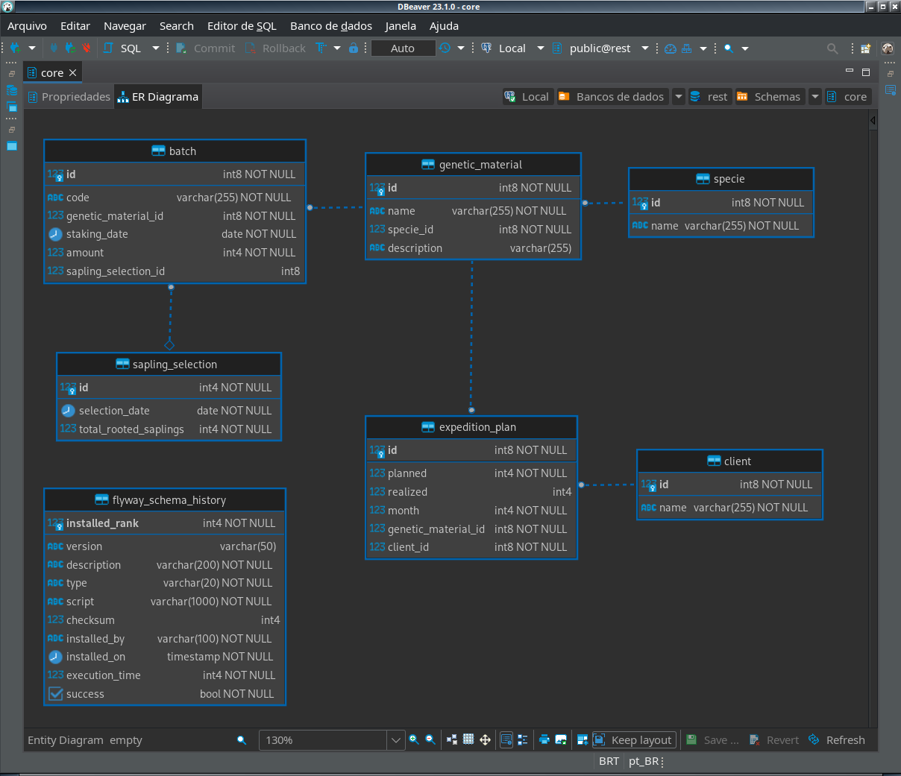
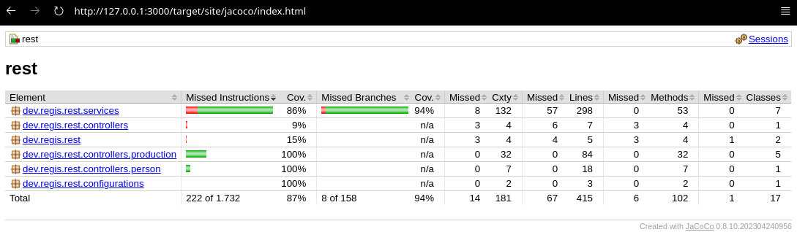
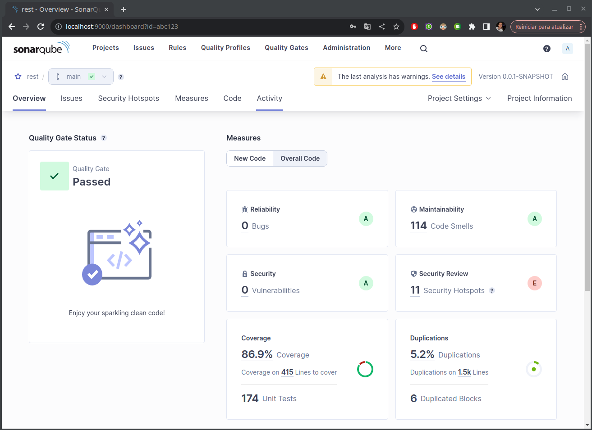
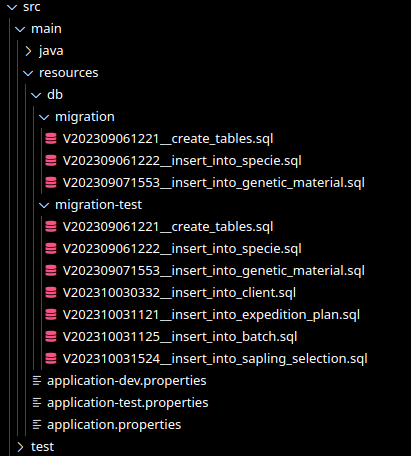

# Trabalho Final do Módulo de Spring Boot na Turma de Java do Programa +Devs2Blu

Este trabalho foi desenvolvido como atividade final para a conclusão do Módulo de Spring Boot na Turma de Java do Programa +Devs2Blu. 

Para o tema a ser desenvolvido, escolhi criar uma API Rest para gerenciar o controle de produção de mudas em um viveiro florestal.

O escopo do problema foi delimitado a partir de uma planilha onde são controlados os dados de produção de estaquias de cada material genético, os lotes de cada um desses materiais, a seleção de mudas dos lotes e o controle dos planos de expedições de cada cliente.

## Normalização dos Dados

Os dados foram analizados a partir da seguinte planilha do excel:



Em um primeiro momento foi analizado o problema, em seguida foram abstraídas as entidades principais e então estabelecido um limite para o escopo inicial da API. 

A partir daí foram selecionados os registros a serem normalizados.

Como se pode ver na planilha acima os registros não possuíam dados compostos nem dependências transitivas, logo foi preciso apenas identificar as entidades e normalizar os dados para a 3FN eliminando assim as redundâncias. O resultado pode ser observado nos diagramas abaixo.


## Diagrama de Classes


## Diagrama ER

Diagrama ER gerado automaticamente pelo DBeaver a partir do BD PostgreSQL:



## Execução e Testes Unitários

- Para rodar esse projeto é necessário ter instalado o JDK 17+ e o Maven 3.x

- Um banco de dados com o nome 'rest' deve ser criado no PostgreSQL.

Comando para rodar o projeto:
```
mvn spring-boot:run
```

Comando para rodar os testes:
```
mvn test
```

Comando para limpar e reconstruir o projeto:
```
mvn clean install
```

## Arquivo Insomnia

O seguinte arquivo pode ser importado no Insomnia para testar manualmente os endpoints da API:

[Insomnia.json](documentation/Insomnia.json)

## Documentação das API’s no Swagger

Com o projeto rodando é possível visualizar a documentação dos endpoints através do Swagger no seguinte endereço:

[http://localhost:8080/swagger-ui/index.html](http://localhost:8080/swagger-ui/index.html)


## Requisitos funcionais, não funcionais e Regras de negócio

### Requisitos Funcionais:

#### Cadastro de Espécies:

- O sistema deve disponibilizar endpoints para criar, listar, visualizar, atualizar e excluir espécies.
- Cada espécie deve ser identificada por um id e um nome único.

#### Cadastro de Materiais Genéticos:

- O sistema deve disponibilizar endpoints para criar, listar, visualizar, atualizar e excluir materiais genéticos.
- Cada material genético deve possuir um identificador único, um nome e uma espécie relacionada.

#### Cadastro de Lotes:

- Deve haver endpoints para criar, listar, visualizar, atualizar e excluir lotes de estaquias
- Cada lote de conter informações como código, data de estaquia, quantidade de estaquias e a referência ao material genético correspondente.
- Cada lote deve possuir um identificador único.

#### Seleção de Mudas:

- Deve ser possível registrar a seleção de mudas a partir de um ou mais lotes, incluindo data de seleção e o número de mudas selecionadas.
- As mudas selecionadas devem estar vinculadas aos lotes correspondentes.

#### Cadastro de Clientes:

- O sistema deve disponibilizar endpoints para criar, listar, visualizar, atualizar e excluir clientes.

#### Plano de Expedição:

- Deve haver endpoints para criar, listar, visualizar, atualizar e excluir planos de expedição.
- Cada plano de expedição deve possuir um id único, a quantidade planejada, a quantidade realizada, o mês e estar associado a um cliente e a um material genético.

### Requisitos Não Funcionais:

- A API deve ser bem documentada, fornecendo informações claras sobre os endpoints disponíveis, seus parâmetros e as respostas esperadas.

- O sistema deve ser capaz de lidar com um grande volume de dados, mantendo uma resposta rápida e eficaz.

- O sistema deve estar disponível para uso durante o horário comercial, com tempo de inatividade mínimo para manutenção.


### Regras de Negócio:

#### Restrição de Cadastro Duplicado:

- Não é permitido cadastrar materiais genéticos, lotes ou clientes com nomes ou códigos duplicados.

#### Vínculo entre Elementos:

- Toda estaquia pertence a um lote específico e a um material genético.
- Toda seleção de mudas está associada a um ou mais lotes.
- Cada plano de expedição está ligado a um cliente e a um material genético.

#### Atualização de Informações:

- A quantidade realizada em um plano de expedição pode ser atualizada após a expedição efetiva das mudas.

#### Integridade Referencial:

- Não é permitido excluir um material genético, espécie, lote ou cliente que tenha registros associados a ele.

#### Consistência de Dados:

- A data de estaquia de um lote deve ser anterior à data de seleção das mudas do mesmo lote.

#### Quantidade de Mudas na Seleção:

- A quantidade de mudas selecionadas de um lote não pode exceder a quantidade de estaquias do lote.

## Cobertura de código

JaCoCo indicou 87% de coverage


Já o SonarQube indicou um coverage de 86.9%



Obs.: Foram excluídas dos testes todas as classes do pacote models (entities e dtos).


## Uso do Flyway para gerenciamento das Migrations

Foi utilizado o Flyway para executar migrations distintas para desenvolvimento e testes:



## Uso do Maven para gerenciamento das dependências e estrutura do projeto

Vide [pom.xml](pom.xml)

## Considerações Finais

O presente trabalho me agregou muito conhecimento em programação Java com o uso do framework Spring Boot, implementação de testes unitários com Junit4, documentação de API com o Swagger, coverage de código, uso do Maven para gerenciamento de dependências, dentre outras tecnologias utilizadas para desenvolvê-lo.

O projeto desenvolvido pode muito bem se tornar uma aplicação para controle na empresa de onde os dados foram analizados, tornando o controle de produção muito mais confiável, sólido e dinâmico.

Algum pontos que ainda precisam ser melhores explorados:

- Implementação da MapStruct para mapeamento das models: Um dos problemas mais complicados que encontrei no desenvolvimento do projeto foi na resolução do relacionamento recursivos nas classes models do sistema utilizando a ModelMapper. Consegui resolver esse problema utilizando a anotação @JsonIgnoreProperties nos relacionamentos, porém essa solução só limita o relacionamento dentro da subclasse relacionada, trazendo ainda informações dos demais objetos relacionados dentro dessa primeira relação. Esse problema pode ser resolvido com o uso do MapStruct, porém gera uma maior complexidade e escrita de códigos, logo acabei optando por aceitar os dados extras que são exibidos dentro dos objetos relacionados nas classes DTOs.

- Criação de exceptions personalizadas para alguns contextos específicos da API;

- Implementação de outros retornos HTTP especícos e personalização de mensagens de acordo com as validações e exeções personalizadas;

- Documentação com o Swagger: Há muito mais opções que podem agregar informações úteis a documentação, melhorando assim o entendimento dos desenvolvedores das aplicações que forem consumir esta API;

- Testes: Para esse projeto foram utilizados testes unitários, para uma melhor qualidade do sistema será necessários implementar testes de integração com alguma aplicação que consuma esta API e testes de carga.

Embora tenha utilizado de abstrações comuns a todas as classes de serviço, reduzindo assim a necessidade de escrever mais linhas de códigos, acabei gerando um grande volume de códigos para um escopo que inicialmente pensei que seria bem reduzido. Acredito que muita coisa ainda pode ser aperfeiçoada e melhorada nesse projeto, há vários aspectos e alguns pontos que ignorei para que pudesse entregá-lo em tempo hábil.

Enfim, foi uma experência gratificante desenvolvê-lo.

Agradeço ao [Marcio Michelluzzi](https://github.com/marciomichelluzzi) que ministrou o módulo com excelência e me orientou no desenvolvimento do projeto.

