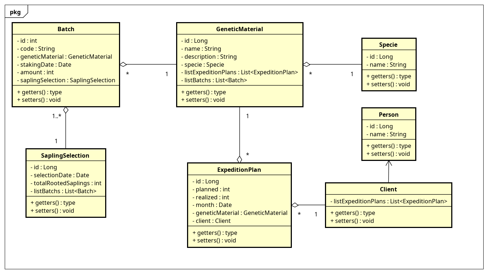
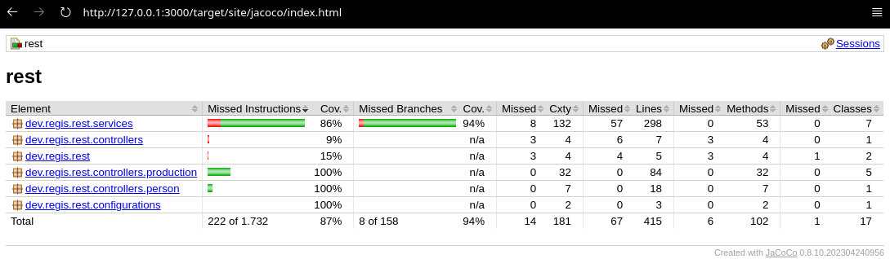
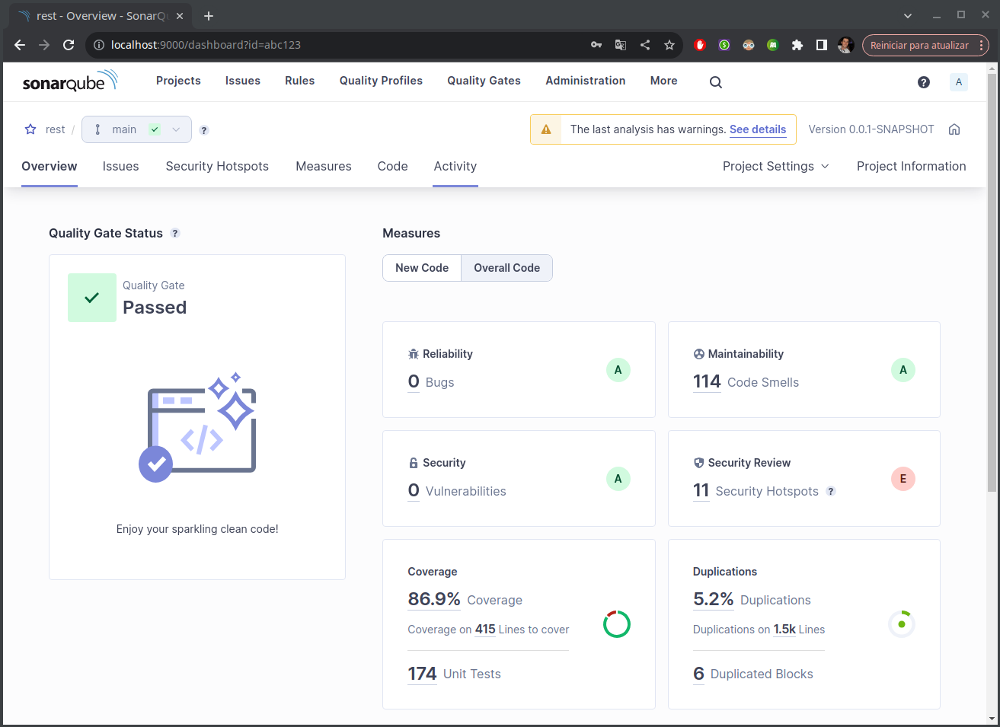
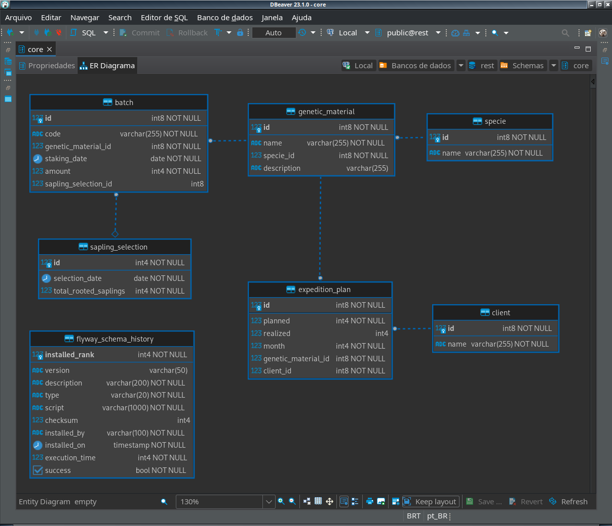
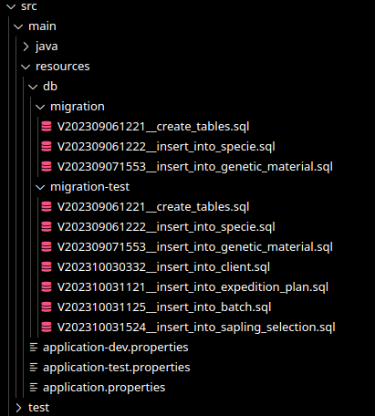
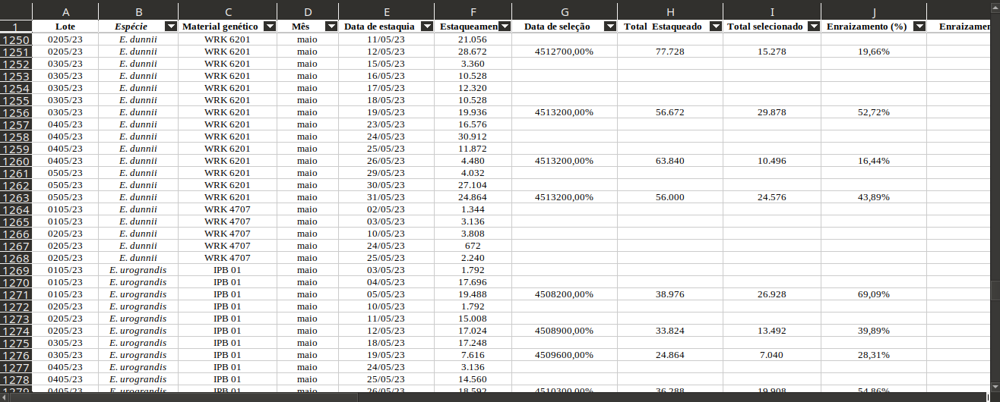

# Trabalho Final do Módulo

## Regras

O aluno deverá construir uma aplicação Java, usando os conceitos apresentados em sala usando as tecnologias do ecossistema Spring.

Pontos que serão OBRIGATÓRIOS para a entrega do trabalho.

- Diagrama de classes da solução; 
- Arquivo Insomnia com exemplos de todas as chamadas de API’s da aplicação;
- Documentação das API’s no Swagger
- Software rodando corretamente;
- Lista de Requisitos funcionais/Requisitos não funcionais/Regras de negócio;
- Cobertura de código de no mínimo 50%;
- Persistencia de dados em Postgres;
- Uso do Flyway para gerenciamento das Migrations;
- Uso do Maven para gerenciamento das dependencias e estrutura do projeto
- PLUS: Deploy no RailWay, conforme tutorial: [****Como configurar o springboot e postgresSQL no Railway****](https://www.notion.so/Como-configurar-o-springboot-e-postgresSQL-no-Railway-301bdf4514fe49eb88fb082298aa8a2a?pvs=21)

Não estão elencados acima porém também são pré requisitos:

- Qualidade de código
- Normalização de banco de dados

## Diagrama de Classes

## Arquivo Insomnia

PENDENTE DE TESTES MANUAIS

## Documentação das API’s no Swagger

PENDENTE DE IMPLEMENTAÇÃO

## Software rodando corretamente

No meu pc roda.   Bazinga! Ta rodando sim, mas depende.

## Requisitos funcionais/Requisitos não funcionais/Regras de negócio

ESCREVER

## Cobertura de código de no mínimo 50%

JaCoCo indicou 87% de coverage

Já o SonarQube indicou um coverage de 86.9%

Obs.: Foram excluídas dos testes todas as classes do pacote models (entities e dtos).

## Persistência de dados em Postgres

Diagrama ER gerado automaticamente pelo DBeaver:

## Uso do Flyway para gerenciamento das Migrations

Foi utilizado o Flyway para executar migrations distintas para desenvolvimento e testes:

## Uso do Maven para gerenciamento das dependências e estrutura do projeto

Vide [pom.xml](pom.xml)

## Normalização dos Dados

Os dados foram analizados a partir de uma planilha do excel:

Em um primeiro momento foi analizado o problema, abstraídas as entidades principais e estabelecido um limite para o escopo inicial do sistema. 

A partir daí foram selecionados os registros a serem normalizados.

Como se pode ver na planilha acima os registros não possuíam dados compostos nem dependências transitivas, logo foi preciso apenas identificar as entidades e normalizar os dados para a 3FN eliminando assim as redundâncias. O resultado pode ser observado do diagrama ER acima.

